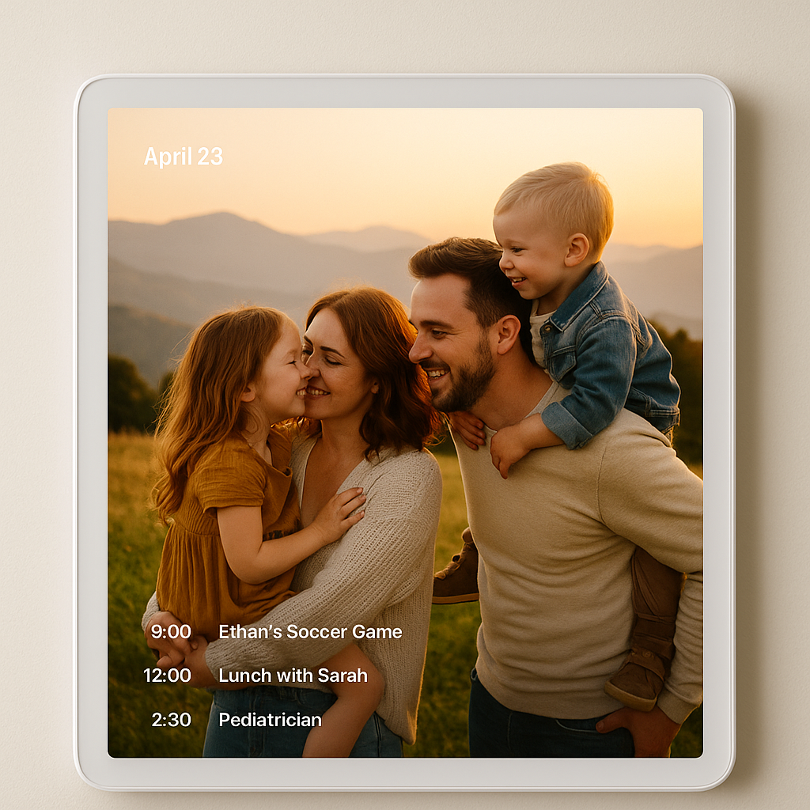

# 🏡 FamilyWall

> _A calm pulse in the center of home life — where family, memory, and daily rhythm come together._

> A living frame for family life.

Tagline:
**The heart of your connected family home.**

Essence:
A digital home centerpiece blending photos, memories, and home control.
It connects your family, calendar, and home assistant into a single, calm, and beautiful interface — always alive, always yours.

Tone & Style:
Warm minimalism · Calm motion · Natural light · Centered design
Keywords: together · warmth · flow · memory · calm · presence

Let’s define a visual identity system for FamilyWall — warm, elegant, and calm; tech-forward but deeply human.

