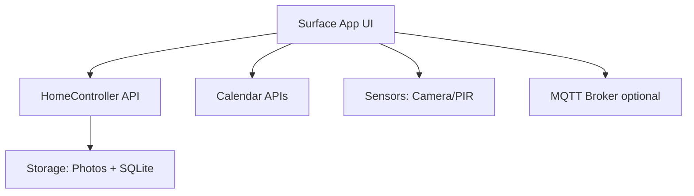
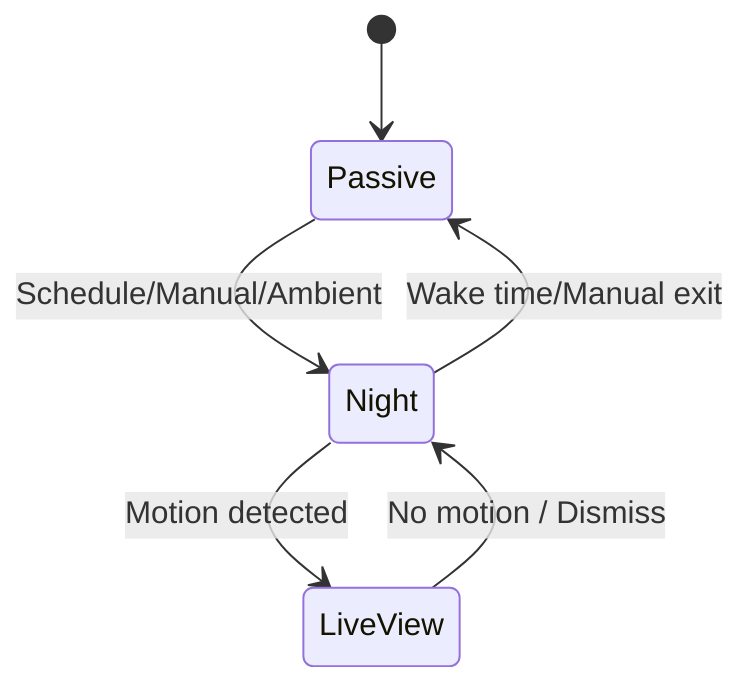

## Home Controller Wall Display – Architecture

This document centralizes technology choices, implementation details, and system architecture. It complements the user-facing requirements in `requirements.md`.

---

## Decisions (Oct 18, 2025)

- UI: Blazor Hybrid (.NET 9 MAUI)
- Calendar: Microsoft Graph API first; Google Calendar may be added later
- Sensors: On-board Surface sensors or USB-connected; prefer default Windows devices/APIs
- Data: SQLite running locally for application data
- Photos: OneDrive and NAS as picture sources

## 1. Technology Stack (Proposed)

- UI / Frontend: Blazor Hybrid (.NET 9 MAUI) with offline support and touchscreen input
- Backend / Data API: .NET 9 Minimal/Web API (optional; local-first app)
- Storage: OneDrive and NAS for photos; SQLite (local) for application metadata
- Calendar Integration: Microsoft Graph API (Google Calendar support later)
- Sensors: On-board camera/mics and USB-connected devices using default Windows device APIs (Windows ML/OpenCV optional); external PIR via ESP32 over MQTT optional
- Sync/Background Jobs: Optional Azure Functions or background services

Notes: Final selections may evolve; track changes here with rationale.

---

## 2. Hardware

- Primary device: Wall-mounted Microsoft Surface (Pro/Laptop mode), always powered and on Wi‑Fi
- Mount: VESA or magnetic mount with concealed power
- Sensors: On-board (camera, mics) or USB-connected to Surface; optional external PIR over Wi‑Fi
- Audio: On-board Surface speakers for notifications/voice

---

## 3. High-level Architecture



Layers and suggested technologies:

| Layer | Component | Technology Suggestion |
| --- | --- | --- |
| UI / Frontend | Wall Display App | Blazor Hybrid (.NET 9 MAUI) |
| Backend / Data API | HomeController API | .NET 9 Minimal/Web API (optional) |
| Storage | Photos & Metadata | OneDrive + NAS (photos) + SQLite (local metadata) |
| Calendar Integration | Outlook / Google | Microsoft Graph API (Google later) |
| Sensors | Motion Detection | On-board Surface sensors or USB; Windows ML/OpenCV; PIR via ESP32 over MQTT (optional) |
| Sync | Photo sync, ratings, events | Background tasks / Azure Functions (optional) |

---

## 4. Presence and Mode Transitions

- Proximity detection via camera motion/face detection, or external PIR/ultrasonic (USB/Wi‑Fi)
- Passive → Interactive on approach; revert after inactivity
- Night Mode entry by schedule/manual/ambient conditions

Implementation notes:
- Camera: Windows `MediaCapture`/DirectShow capture pipeline
- Motion detection: OpenCV frame differencing + morphology; adaptive thresholds
- Power: Prevent system sleep; allow display-off with Modern Standby policies

---

## 5. Photo Module

- Sources: Local folder, OneDrive, or Google Photos API
- Selection logic: same date in prior years; fallback ±3 days
- Interactive features: swipe, favorite/rate, map location from EXIF, details view, browse-by-date
- Caching and prefetch for smooth transitions

---

## 6. Calendar Module

- Integrations: Microsoft Graph / Google Calendar
- Display: today + next 7 days; birthday highlighting
- Interactive: add/edit appointments, recurring dates, filters (personal/family/work)

---

## 7. Night Mode – Technical Design

Objective: At bedtime the display is off while camera monitors motion; on motion, wake and show low-latency live camera preview until inactivity.

### 7.1 Capture & Motion
- Camera capture via `MediaCapture`/DirectShow
- Analyze ~10–15 fps; throttle when idle
- OpenCV frame differencing; dynamic thresholds; morphological filtering

### 7.2 Performance & Power
- Keep pipeline warm for sub-300 ms wake-to-live
- Prevent OS sleep; allow backlight-off

### 7.3 Privacy & Recording
- On-device processing only by default
- Optional ring buffer (10–30 s) and local encrypted clips (Windows DPAPI/Key Vault)
- On-screen LIVE indicator when preview is visible

### 7.4 Fail-safes
- Watchdog to restart pipeline on stall
- Fallback to PIR if camera unavailable; show clock if no preview

State machine excerpt:



---

## 8. Home Assistant Integration – Technical Design

Goal: Use the panel as both a control surface and a device in Home Assistant (HA).

### 8.1 Integration Approaches
- Option A: Embedded HA UI (Edge/Chromium kiosk or companion app if available)
- Option B: Native control panel using HA WebSocket + REST
- Hybrid: Native quick actions + embedded Lovelace view

### 8.2 Auth & Security
- Long-Lived Access Token (LLAT) stored in Windows Credential Locker
- HTTPS with valid cert; reject mixed content
- Dedicated HA user (limited scopes); optionally LAN-only

### 8.3 Communication Paths
- WebSocket: `/api/websocket` (subscribe to `state_changed`)
- REST: `/api/services/<domain>/<service>` for actions
- MQTT: Device publishes local sensors; MQTT Discovery for HA auto-add

### 8.4 Entities via MQTT Discovery

Suggested entities (prefix `surface_panel_*`):
- binary_sensor.motion
- binary_sensor.presence
- sensor.screen_state (off|ambient|interactive|night_live)
- sensor.brightness (0–100%)
- sensor.device_temperature (if available)
- camera.surface_preview (optional low-FPS preview)
- button.wake_screen (HA → device)

Discovery payload examples:

```json
{
	"name": "Surface Panel Motion",
	"state_topic": "home/surface_panel/motion/state",
	"device_class": "motion",
	"unique_id": "surface_panel_motion_1",
	"availability": [{"topic": "home/surface_panel/status"}],
	"device": {"identifiers": ["surface_panel_1"], "name": "Surface Panel", "manufacturer": "Microsoft"}
}
```

```json
{
	"name": "Surface Screen State",
	"state_topic": "home/surface_panel/screen/state",
	"icon": "mdi:monitor",
	"unique_id": "surface_panel_screen_1",
	"availability": [{"topic": "home/surface_panel/status"}],
	"device": {"identifiers": ["surface_panel_1"]}
}
```

Runtime topics:
- home/surface_panel/status → online|offline
- home/surface_panel/motion/state → ON|OFF
- home/surface_panel/screen/state → off|ambient|interactive|night_live

### 8.5 UI Considerations for Control Mode
- Full-screen kiosk; hide OS chrome; prevent day-time sleep
- Rooms grid: main light toggle, dim slider, favorite scenes, last motion, temp/humidity
- Scenes row: one-tap scenes (Dinner, Movie, Focus, Bedtime)
- Devices drawer: search entities; favorites
- Optional SVG floorplan with entity bindings

### 8.6 Native Quick Actions

HTTP examples:

```http
POST /api/services/light/turn_on
{
	"entity_id": "light.living_ceiling",
	"brightness_pct": 45
}
```

```http
POST /api/services/scene/turn_on
{ "entity_id": "scene.movie" }
```

### 8.7 Automations (HA YAML)

```yaml
alias: Surface – Wake on Hall Motion at Night
trigger:
	- platform: state
		entity_id: binary_sensor.hall_motion
		to: 'on'
condition:
	- condition: sun
		after: sunset
action:
	- service: mqtt.publish
		data:
			topic: home/surface_panel/cmd
			payload: '{"action":"wake_screen"}'
```

```yaml
alias: Surface – Sync Night Mode
trigger:
	- platform: state
		entity_id: sensor.surface_panel_screen_state
		to: night_live
action:
	- service: scene.turn_on
		target:
			entity_id: scene.night
```

---

## 9. Build and Kiosk Boot

- Auto-launch app on user login
- Suppress sleep during day-time modes
- Configure network and certs for HA connectivity

---

## 10. Open Questions / Decisions

- Final choice between Blazor Hybrid vs PWA
- Preferred photo source priority
- Exact Night Mode thresholds and defaults
- HA integration approach: A, B, or Hybrid

