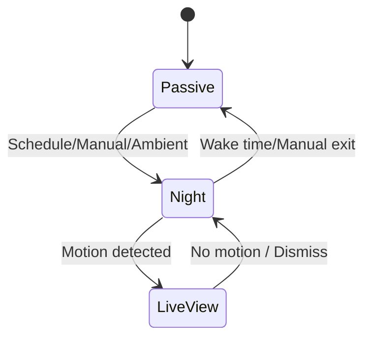

## Home Controller Wall Display – Architecture

This document centralizes technology choices, implementation details, and system architecture. It complements the user-facing requirements in `requirements.md`.

---


## 1. Technology Stack (Local-only)

- UI / Frontend: Blazor Hybrid (.NET 9 MAUI) with offline support and touchscreen input
- App Runtime: Single-process local app (no separate backend). Optional local Windows service/background worker if needed for scheduling or indexing. No cloud-hosted components.
- Storage: NAS (SMB/WebDAV) as primary photo source; OneDrive via Microsoft Graph/OneDrive API (connected application). SQLite (local) for app metadata, cache, and offline data.
- Calendar Integration: Client-side Microsoft Graph and/or Google Calendar APIs using OAuth device code flow, or ICS/CalDAV where available. All calls are made directly from the device; no server-side middle tier.
- Sensors: On-device camera/mics and USB-connected devices via Windows APIs (Windows ML/OpenCV optional); optional external PIR via ESP32 over LAN/MQTT.
- Background Jobs: In-app background services or optional local Windows service. No Azure Functions or other cloud workers.

- Rendering: Prefer WebView2/CSS animations where feasible under kiosk constraints; use native (WinUI/Skia) paths only when low-latency or composition requirements demand it.

Operational constraints:
- No owned cloud infrastructure (Azure, AWS, etc.). The app may connect to existing third-party services (e.g., Microsoft/Google calendars, Home Assistant on LAN) directly from the device.
- Secrets are stored locally via Windows Credential Locker/DPAPI. No Azure Key Vault.

Notes: Final selections may evolve; track changes here with rationale.

---

## 2. Hardware

- Primary device: Wall-mounted Microsoft Surface (Pro/Laptop mode), always powered and on Wi‑Fi
- Mount: VESA or magnetic mount with concealed power
- Sensors: On-board (camera, mics) or USB-connected to Surface; optional external PIR over Wi‑Fi
- Audio: On-board Surface speakers for notifications/voice

---

## 3. High-level Architecture

```mermaid
flowchart TD
		A[Surface App (UI + Local Services)] --> C[Local Storage: SQLite + Cache]
		A --> P[NAS Photos (SMB/WebDAV or local synced folder)]
		A --> D[Calendar Providers (Graph/Google/ICS/CalDAV)]
		A --> E[Sensors: Camera/PIR]
		A --> H[Home Assistant (LAN)]
		A --> M[MQTT (existing broker, optional)]
```

Layers and suggested technologies:

| Layer | Component | Technology Suggestion |
| --- | --- | --- |
| UI / Frontend | Wall Display App | Blazor Hybrid (.NET 9 MAUI) |
| App Services | Local background/indexing | .NET hosted services in-app; optional local Windows service |
| Storage | Photos & Metadata | NAS (SMB/WebDAV) + OneDrive API (Graph) + local cache; SQLite (local metadata) |
| Calendar Integration | Outlook / Google | Client-side Microsoft Graph / Google APIs; ICS/CalDAV where available |
| Sensors | Motion Detection | On-board Surface sensors or USB; Windows ML/OpenCV; PIR via ESP32 over LAN/MQTT (optional) |
| Sync | Photo indexing, ratings, events | Local background tasks only (no cloud) |

---

## 4. Presence and Mode Transitions

- Proximity detection via camera motion/face detection, or external PIR/ultrasonic (USB/Wi‑Fi)
- Passive → Interactive on approach; revert after inactivity
- Night Mode entry by schedule/manual/ambient conditions

- Default Interactive Mode on Presence: Configurable – choose a fixed mode (e.g., Calendar) or resume last-used mode on approach.
- Dwell/Passerby Heuristic: Avoid triggering interactive mode for passersby using dwell-time and motion-velocity thresholds within a region-of-interest; provide configurable thresholds with sensible defaults to be tuned with testing.
- Sensor fusion: Use the best signals from all available sensors (camera motion, optional face detection, and PIR/ultrasonic if present). Fuse signals for robustness and define sensible fallback ordering when certain sensors are unavailable.

Implementation notes:
- Camera: Windows `MediaCapture`/DirectShow capture pipeline
- Motion detection: OpenCV frame differencing + morphology; adaptive thresholds
- Power: Prevent system sleep; allow display-off with Modern Standby policies
- Preview/UI composition: Low-latency camera preview via native MAUI/WinUI control; UI overlays via XAML, or place Blazor WebView adjacent without compositing over preview when needed for performance.

---

## 5. Photo Module

- Sources: NAS (primary) and OneDrive via Microsoft Graph/OneDrive API (connected app); optional additional local folders
- Source priority: Prefer NAS as the primary photo source while integrating OneDrive recency bias so newer cloud photos are surfaced periodically.
- Auth: Device Code flow OAuth for Microsoft account; store tokens in Windows Credential Locker; refresh tokens handled on-device.
- Caching: Maintain a local photo cache and metadata index (SQLite) for smooth offline behavior.
- Selection logic: same date in prior years; fallback ±3 days
- Interactive features: swipe, favorite/rate, map location from EXIF, details view, browse-by-date
- Caching and prefetch for smooth transitions
- Offline behavior: When offline, continue showing the last cached photo and cycle through available cached media until connectivity returns.

---

## 6. Calendar Module

- Integrations: Client-side Microsoft Graph / Google Calendar (OAuth device code flow), or ICS/CalDAV where available
- Display: today + next 7 days; birthday highlighting
- Interactive: add/edit appointments, recurring dates, filters (personal/family/work)

- Birthdays Source: Prefer Microsoft Contacts/People birthdays; fallback to the generated Birthday Calendar when contacts are unavailable.
- Offline Edits: Editing is disabled when offline. Show read-only views and a clear “offline” indicator; resume editing on reconnect.

---

## 7. Night Mode – Technical Design

Objective: At bedtime the display is off while camera monitors motion; on motion, wake and show low-latency live camera preview until inactivity.

### 7.1 Capture & Motion
- Camera capture via `MediaCapture`/DirectShow
- Analyze ~10–15 fps; throttle when idle
- OpenCV frame differencing; dynamic thresholds; morphological filtering
- Initial thresholds: Start with minimal/no additional thresholding and evaluate in real environments; introduce filtering/hysteresis only if necessary based on observed false positives.

### 7.2 Performance & Power
- Keep pipeline warm for sub-300 ms wake-to-live
- Prevent OS sleep; allow backlight-off
- Follow platform best practices for Modern Standby and MAUI/WinUI background operation to keep the capture pipeline warm while the display is off, within device power constraints.

-### 7.3 Privacy & Recording
- On-device processing only by default
- Optional ring buffer (10–30 s) and local encrypted clips (Windows DPAPI)
- On-screen LIVE indicator when preview is visible

Defaults and consent:
- Recording is off by default overall. In Night Mode specifically, motion-triggered clip recording is enabled by default with a 3‑day retention, provided the user granted explicit consent on first run. Users can change retention and recording at any time.

### 7.4 Fail-safes
- Watchdog to restart pipeline on stall
- Fallback to PIR if camera unavailable; show clock if no preview

State machine excerpt:



---

## 8. Home Assistant Integration – Technical Design

Goal: Use the panel as both a control surface and a device in Home Assistant (HA).

### 8.1 Integration Approaches
- Option A: Embedded HA UI (Edge/Chromium kiosk or companion app if available)
- Option B: Native control panel using HA WebSocket + REST
- Hybrid: Native quick actions + embedded Lovelace view

Chosen for MVP: Hybrid. Start with embedding a Lovelace view to achieve coverage quickly; progressively add native quick actions (lights/scenes/favorites) for low-latency control.

### 8.2 Auth & Security
- Long-Lived Access Token (LLAT) stored in Windows Credential Locker
- HTTPS with valid cert; reject mixed content
- Dedicated HA user (limited scopes); optionally LAN-only

### 8.3 Communication Paths
- WebSocket: `/api/websocket` (subscribe to `state_changed`)
- REST: `/api/services/<domain>/<service>` for actions
- MQTT: Device publishes local sensors; MQTT Discovery for HA auto-add (use existing broker on LAN; do not host a cloud broker)

### 8.4 Entities via MQTT Discovery

Suggested entities (prefix `surface_panel_*`):
- binary_sensor.motion
- binary_sensor.presence
- sensor.screen_state (off|ambient|interactive|night_live)
- sensor.brightness (0–100%)
- sensor.device_temperature (if available)
- camera.surface_preview (optional low-FPS preview)
- button.wake_screen (HA → device)

Discovery payload examples:

```json
{
	"name": "Surface Panel Motion",
	"state_topic": "home/surface_panel/motion/state",
	"device_class": "motion",
	"unique_id": "surface_panel_motion_1",
	"availability": [{"topic": "home/surface_panel/status"}],
	"device": {"identifiers": ["surface_panel_1"], "name": "Surface Panel", "manufacturer": "Microsoft"}
}
```

```json
{
	"name": "Surface Screen State",
	"state_topic": "home/surface_panel/screen/state",
	"icon": "mdi:monitor",
	"unique_id": "surface_panel_screen_1",
	"availability": [{"topic": "home/surface_panel/status"}],
	"device": {"identifiers": ["surface_panel_1"]}
}
```

Runtime topics:
- home/surface_panel/status → online|offline
- home/surface_panel/motion/state → ON|OFF
- home/surface_panel/screen/state → off|ambient|interactive|night_live

### 8.5 UI Considerations for Control Mode
- Full-screen kiosk; hide OS chrome; prevent day-time sleep
- Rooms grid: main light toggle, dim slider, favorite scenes, last motion, temp/humidity
- Scenes row: one-tap scenes (Dinner, Movie, Focus, Bedtime)
- Devices drawer: search entities; favorites
- Optional SVG floorplan with entity bindings

- Accessibility: Start with best-effort sizes and contrast for 1–3 m readability; iterate based on user feedback and real-world testing.

### 8.6 Native Quick Actions

HTTP examples:

```http
POST /api/services/light/turn_on
{
	"entity_id": "light.living_ceiling",
	"brightness_pct": 45
}
```

```http
POST /api/services/scene/turn_on
{ "entity_id": "scene.movie" }
```

### 8.7 Automations (HA YAML)

```yaml
alias: Surface – Wake on Hall Motion at Night
trigger:
	- platform: state
		entity_id: binary_sensor.hall_motion
		to: 'on'
condition:
	- condition: sun
		after: sunset
action:
	- service: mqtt.publish
		data:
			topic: home/surface_panel/cmd
			payload: '{"action":"wake_screen"}'
```

```yaml
alias: Surface – Sync Night Mode
trigger:
	- platform: state
		entity_id: sensor.surface_panel_screen_state
		to: night_live
action:
	- service: scene.turn_on
		target:
			entity_id: scene.night
```

---

## 9. Build and Kiosk Boot

- Auto-launch app on user login
- Suppress sleep during day-time modes
- Configure network and certs for HA connectivity
- Use a dedicated Windows kiosk user account with automatic login and least-privilege access to required resources only.

Local-only guideline: Updates are applied manually or via LAN file share; no cloud telemetry or auto-update services are required.

---

## 10. Open Questions / Decisions

Open questions
- Background/lifecycle strategy details for keeping the camera capture pipeline warm while the display is off (specific Modern Standby configurations and constraints)
- Exact Night Mode motion thresholds after field testing; if minimal filtering proves insufficient, define day/night profiles and hysteresis values
- Calendar write support: choose primary path (Graph/Google client-side vs. CalDAV) given the constraint of no owned cloud components

